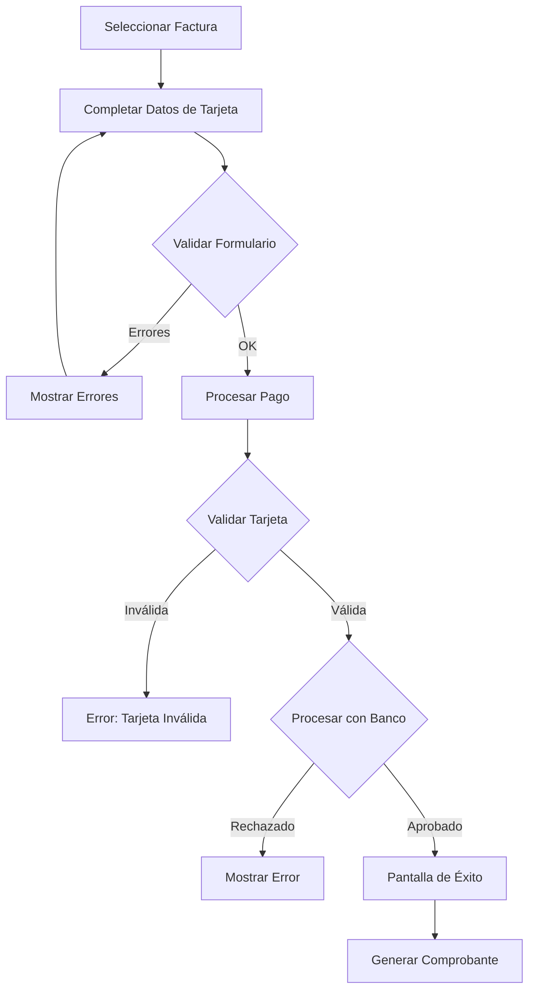

# 💳 Pasarela de Pago Simulada

## 📋 Descripción General

Sistema de pago simulado realista que incluye validaciones de tarjeta, diferentes escenarios de respuesta, y procesamiento visual para el sistema de gestión de la cooperativa eléctrica.

---

## 🎯 Características Principales

### ✅ Validaciones Implementadas

1. **Algoritmo de Luhn**
   - Validación matemática del número de tarjeta
   - Detecta errores de tipeo automáticamente
   - Compatible con tarjetas de 13-19 dígitos

2. **Detección de Tipo de Tarjeta**
   - Visa (comienza con 4)
   - Mastercard (comienza con 51-55)
   - American Express (comienza con 34, 37)
   - Discover (comienza con 6011, 65)

3. **Validación de Fecha de Vencimiento**
   - Formato MM/AA
   - Verifica que no esté vencida
   - Valida mes (01-12)

4. **Validación de CVV**
   - 3-4 dígitos numéricos
   - Solo números permitidos

5. **Validación de Titular**
   - Mínimo 3 caracteres
   - Formato en mayúsculas

---

## 🧪 Tarjetas de Prueba

### ✅ Siempre Aprobadas

| Tipo | Número | Uso |
|------|--------|-----|
| Visa | `4111 1111 1111 1111` | Pago exitoso garantizado |
| Mastercard | `5555 5555 5555 4444` | Pago exitoso garantizado |

### ❌ Casos de Error

| Caso | Condición | Mensaje |
|------|-----------|---------|
| Fondos insuficientes | Último dígito: 0 | "Fondos insuficientes" |
| Tarjeta bloqueada | Último dígito: 9 | "Tarjeta bloqueada. Contacte a su banco" |
| Rechazo aleatorio | 10% probabilidad | "Transacción rechazada por el banco" |

### 📝 Datos de Prueba Adicionales

- **Vencimiento:** Cualquier fecha futura (ej: `12/25`, `06/26`)
- **CVV:** Cualquier 3-4 dígitos (ej: `123`, `4567`)
- **Titular:** Cualquier nombre de 3+ caracteres (ej: `JUAN PEREZ`)

---

## 🔄 Flujo de Pago



---

## 💻 Uso del Componente

### Importación

```javascript
import PagoOnline from './components/cliente/PagoOnline';
```

### Integración con Backend (TODO)

```javascript
// En clienteService.js
async pagarFactura(facturaId, respuestaPago) {
  return apiClient.post(`/api/clientes/facturas/${facturaId}/pagar`, {
    codigo_autorizacion: respuestaPago.codigo_autorizacion,
    tipo_tarjeta: respuestaPago.tipo_tarjeta,
    ultimos_digitos: respuestaPago.ultimos_digitos,
    monto: respuestaPago.monto
  });
}
```

### Backend Endpoint (TODO)

```javascript
// POST /api/clientes/facturas/:id/pagar
router.post('/facturas/:id/pagar', async (req, res) => {
  const { id } = req.params;
  const { codigo_autorizacion, tipo_tarjeta, ultimos_digitos, monto } = req.body;
  
  try {
    // Actualizar estado de la factura
    await Factura.actualizarEstado(id, 'PAGADA');
    
    // Registrar el pago
    const pago = await Pago.crear({
      factura_id: id,
      codigo_autorizacion,
      tipo_tarjeta,
      ultimos_digitos,
      monto,
      fecha_pago: new Date()
    });
    
    // Enviar email de confirmación
    await emailService.enviarComprobantePago(factura, pago);
    
    return res.json({ success: true, pago });
  } catch (error) {
    return res.status(500).json({ error: error.message });
  }
});
```

---

## 🎨 Características de UX

### 1. **Formateo Automático**
- Número de tarjeta: agrega espacios cada 4 dígitos
- Vencimiento: agrega barra automáticamente (MM/AA)
- CVV: solo permite números
- Titular: convierte a mayúsculas

### 2. **Feedback Visual**
- Detección de tipo de tarjeta en tiempo real
- Errores de validación debajo de cada campo
- Estados de carga con spinner animado
- Animaciones de éxito/error

### 3. **Pantalla de Éxito**
- Código de autorización único
- Detalles completos de la transacción
- Información de tarjeta enmascarada (•••• 1234)
- Fecha y hora de la transacción
- Opciones de navegación

### 4. **Manejo de Errores**
- Alertas visuales en rojo
- Mensajes descriptivos
- Validación en tiempo real
- Limpieza de errores al corregir

---

## 📊 Respuesta de Pago

### Estructura de Respuesta Exitosa

```javascript
{
  aprobado: true,
  codigo_autorizacion: "A3F9K7M2P",
  tipo_tarjeta: "Visa",
  ultimos_digitos: "1111",
  fecha_transaccion: "2025-10-02T14:30:00.000Z",
  monto: 15000
}
```

### Casos de Error

```javascript
throw new Error("Número de tarjeta inválido");
throw new Error("Tarjeta vencida o fecha inválida");
throw new Error("CVV inválido");
throw new Error("Nombre del titular inválido");
throw new Error("Fondos insuficientes");
throw new Error("Tarjeta bloqueada. Contacte a su banco");
throw new Error("Transacción rechazada por el banco");
```

---

## 🔐 Seguridad

### Implementado
- ✅ Validación client-side completa
- ✅ No se almacenan datos de tarjeta en estado
- ✅ CVV con input type="password"
- ✅ Enmascaramiento de número de tarjeta en comprobante

### Por Implementar (Producción)
- 🔒 Tokenización de tarjetas
- 🔒 Integración con gateway real (MercadoPago, Stripe)
- 🔒 PCI DSS compliance
- 🔒 3D Secure / SCA
- 🔒 Rate limiting
- 🔒 Logs de auditoría
- 🔒 Webhook para confirmación asíncrona

---

## 🧪 Testing Manual

### Caso 1: Pago Exitoso
1. Seleccionar una factura pendiente
2. Ingresar: `4111 1111 1111 1111`
3. Vencimiento: `12/25`
4. CVV: `123`
5. Titular: `JUAN PEREZ`
6. Click "Pagar Ahora"
7. ✅ Debe mostrar pantalla de éxito con código de autorización

### Caso 2: Tarjeta Inválida
1. Ingresar: `1234 5678 9012 3456`
2. Click "Pagar Ahora"
3. ❌ Debe mostrar error "Número de tarjeta inválido"

### Caso 3: Tarjeta Vencida
1. Ingresar tarjeta válida
2. Vencimiento: `12/20` (fecha pasada)
3. Click "Pagar Ahora"
4. ❌ Debe mostrar error "Tarjeta vencida o fecha inválida"

### Caso 4: Fondos Insuficientes
1. Ingresar: `4532 1111 1111 1110` (termina en 0)
2. Completar otros campos
3. Click "Pagar Ahora"
4. ❌ Debe mostrar error "Fondos insuficientes"

### Caso 5: Tarjeta Bloqueada
1. Ingresar: `5555 5555 5555 4449` (termina en 9)
2. Completar otros campos
3. Click "Pagar Ahora"
4. ❌ Debe mostrar error "Tarjeta bloqueada"

---

## 📈 Métricas de Simulación

- **Latencia de respuesta:** 2-3 segundos (simulado)
- **Tasa de aprobación:** ~90% (configurable)
- **Tipos de tarjeta soportados:** 4 principales
- **Validaciones implementadas:** 5 niveles

---

## 🚀 Próximos Pasos

1. **Integración Backend**
   - Crear endpoint `/api/clientes/facturas/:id/pagar`
   - Actualizar estado de factura en DB
   - Registrar transacción en tabla `pagos`

2. **Notificaciones**
   - Email con comprobante de pago
   - PDF del recibo
   - Notificación push (opcional)

3. **Pasarela Real**
   - Integrar MercadoPago SDK
   - O integrar Stripe Checkout
   - Configurar webhooks para confirmación

4. **Auditoría**
   - Logs de transacciones
   - Dashboard de pagos para admin
   - Reportes de pagos exitosos/fallidos

---

## 📞 Soporte

Para consultas sobre la implementación de la pasarela de pago, contactar al equipo de desarrollo.

**Última actualización:** Octubre 2, 2025
